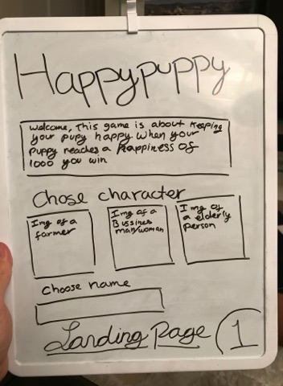
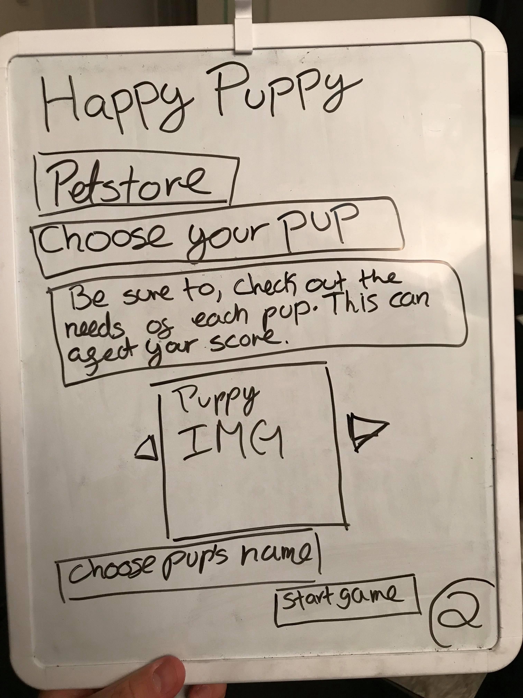
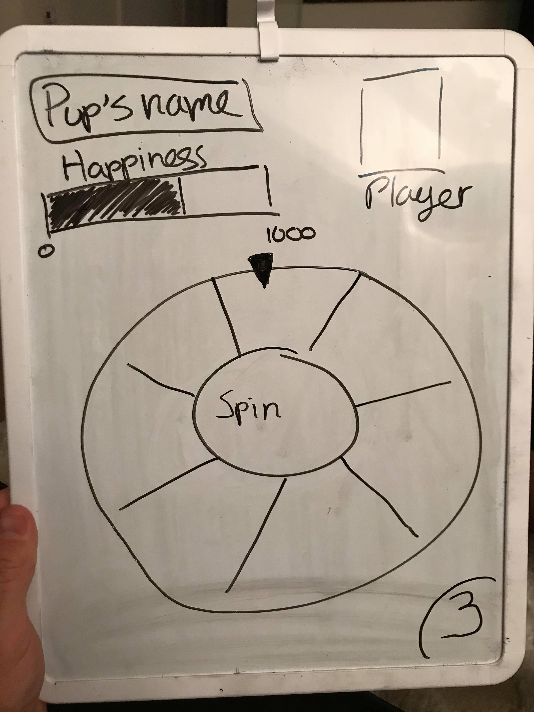
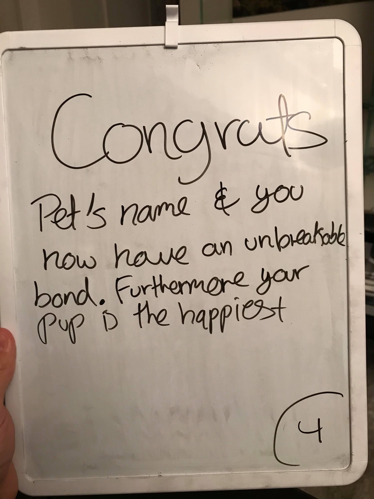
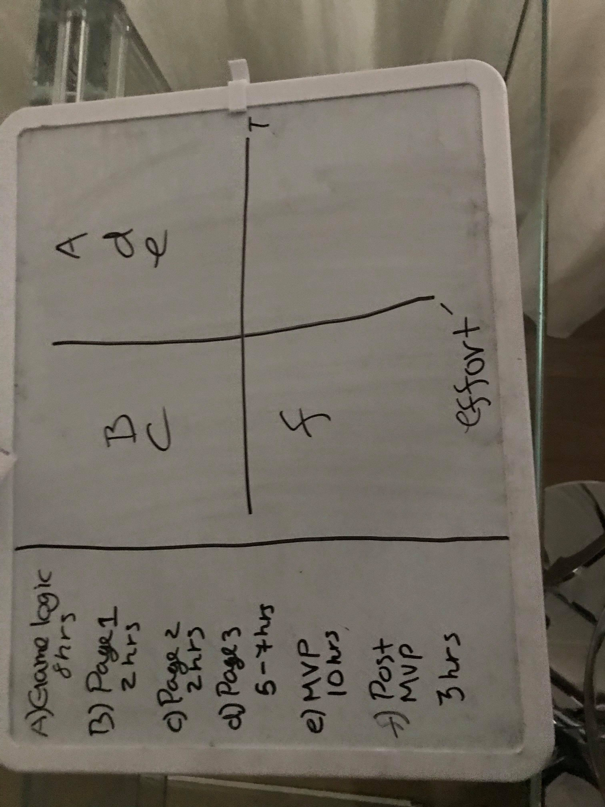

# Project Overview

## Project Schedule

This schedule will be used to keep track of your progress throughout the week and align with our expectations.  

|  Day | Deliverable | 
|---|---| 
|Day 1: Tue| Wireframes and Priority Matrix|
|Day 2: Wed| Project Approval /  Pseudocode / actual code|
|Day 3: Thur| Basic Clickable Model |
|Day 4: Fri| Working Prototype |
|Day 5: Sat| Final Working Project |
|Day 6: Sun| Bugs / Stylying / PostMVP |
|Day 7: Mon| Project Presentations |

## Project Description
This game is about creatting a long lasting bong with you dog, by helping your pup reach his maximun happiness. In the landing page you must choose a character and clikc 'petstore' to go to the next page. Where you will be in a petstore where you have to choose a puppie. Each character and puppie has different qualities. Each quality given a value for each character. Each quality is rated from 1-10. For the dogs it is rated -1 to -10. Afetr choosing a character and a puppy the user clicks start game. The pupiess name and a happiness bar appear at the top and a spinning wheel in the middle. 
The wheel is spin at the click of a buttom and the user also stops the wheel. Landing in a square. Which will have a intruction for example; 'Take your dog out for a walk'. This intruction will contain a value from 1 to 3. This is them multiplied by the character´s quality and then substracted by the dogs needs. Which will add or substract to the gos happiness bar and score. When the dogs happiness bar if full you win and if it reaches zero you loose.
## Wireframes

## Priority Matrix

Include a full list of features that have been prioritized based on the `Time and Importance` Matix.  

## Game Components

### Landing Page
What will a player see when they start your game?

### Game Initialization
What will a player see when the game is started? 

### Playing The Game
What will be the flow of the game, what will the user be expeted to do and what will the user expect from the gam

### Winning The Game
What does it look like when the game ends, what determines winning or losing?

### Game Reset
How will the user restart the game once it has been completed.

## MVP 

Include the full list of features that will be part of your MVP 

## POST MVP

Include the full list of features that you are considering for POST MVP
## Functional Components

Based on the initial logic defined in the previous game phases section try and breakdown the logic further into functional components, and by that we mean functions.  Does your logic indicate that code could be encapsulated for the purpose of reusablility.  Once a function has been defined it can then be incorporated into a class as a method. 

Time frames are also key in the development cycle.  You have limited time to code all phases of the game.  Your estimates can then be used to evalute game possibilities based on time needed and the actual time you have before game must be submitted. 

| Component | Priority | Estimated Time | Time Invetsted | Actual Time |
| --- | :---: |  :---: | :---: | :---: |
| Component 1 | H | 10hrs| 12hrs | 12hrs |
| Total |  | 10hrs| 12hrs | 12hrs |

## Helper Functions
Helper functions should be generic enought that they can be reused in other applications. Use this section to document all helper functions that fall into this category.

| Function | Description | 
| --- | :---: |  
| Capitalize | This will capitalize the first letter in a string | 

## Additional Libraries
 Use this section to list all supporting libraries and thier role in the project. 

## Code Snippet

Use this section to include a brief code snippet of functionality that you are proud of an a brief description.  

## jQuery Discoveries
 Use this section to list some, but not all, of the jQuery methods and\or functionality discovered while working on this project.

## Change Log
 Use this section to document what changes were made and the reasoning behind those changes.  

## Issues and Resolutions
 Use this section to list of all major issues encountered and their resolution.

#### SAMPLE.....
**ERROR**: app.js:34 Uncaught SyntaxError: Unexpected identifier                                
**RESOLUTION**: Missing comma after first object in sources {} object
